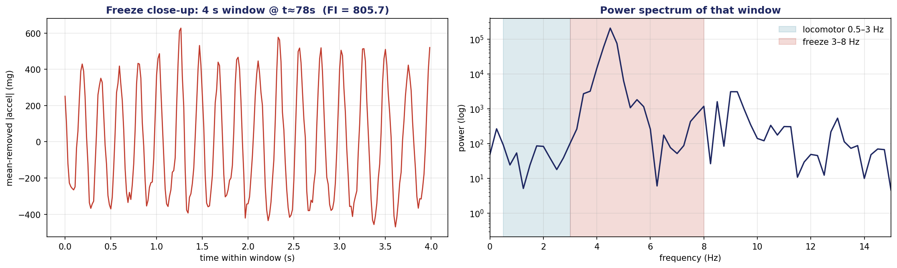
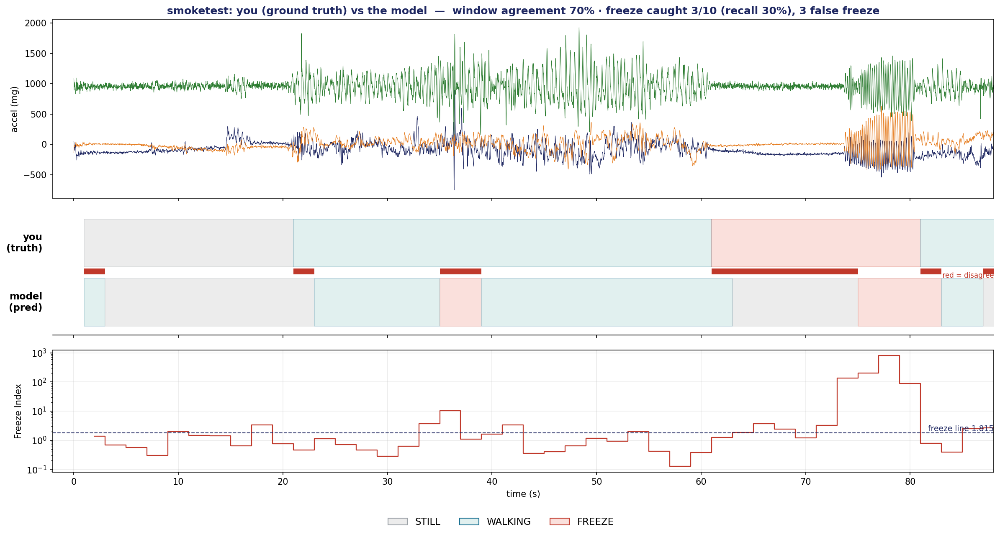

# Cadence — a wearable freeze-of-gait monitor for Parkinson's disease

Cadence is a low-cost, ankle-worn wearable that **detects and displays freeze-of-gait
(FoG)** episodes in Parkinson's disease from a single accelerometer. It is a **monitor,
not a cueing therapy**: it recognises freezes and shows them — on the device's screen
and LEDs, and on a live dashboard — and the fitted vibration motor is **disabled in
firmware**. The detector is a transparent, "glass-box" Freeze Index that runs on the
device itself; a small neural network is included as a learned alternative.

> Built for UCL **ENGF0031 — Scenario 2 ("Smart Clothing")**.
> Research / educational project — **not a medical device, not for clinical use.**



*A 4-second window during a freeze: rapid foot tremor (left) whose power concentrates
in the 3–8 Hz "freeze" band (right). That spectral signature is what the detector keys on.*

---

## How it works

```
accelerometer (3 axes, 64 Hz)
        │
        ▼
   magnitude  ──► orientation-invariant, mean removed
        │
        ▼
   4 s window  ──► Fourier / Welch power spectrum
        │
        ▼
   Freeze Index = power(3–8 Hz freeze band) / power(0.5–3 Hz walking band)
        │
        ▼
   gate (is the limb moving?)  +  2-window debounce
        │
        ▼
   STILL  /  WALKING  /  FREEZE     ──► OLED + LEDs + live dashboard
```

A freeze is the rapid (≈3–8 Hz) trembling of the feet in place, distinct from the slow
(≈1–2 Hz) rhythm of walking. The **Freeze Index** captures exactly that — a single
ratio crossing a fixed threshold — so every decision is explainable. A **1-D CNN
(FoGNet, ~18k parameters)** is also trained as a learned alternative, but the
interpretable detector is the one that ships.

## Results

All figures are real (computed from on-body captures and the public Daphnet benchmark).
The headline metric is **sensitivity & specificity**, not accuracy — freezes are rare,
so a single accuracy number hides the error that matters (a missed freeze).

| Detector | Sensitivity | Specificity | Evaluation |
|---|---|---|---|
| **Freeze Index** (deployed, glass-box) | **0.83** | **0.92** | worksheet operating point, FI > 1.815 |
| FoGNet CNN (learned alternative) | 0.71 | 0.84 | Daphnet, leave-one-subject-out (unseen patients) |



*Cross-examination: the device's call (bottom strip) against the recorded protocol (top
strip), with the live Freeze Index underneath.*

## Repository layout

| Path | Contents |
|---|---|
| `pi/` | Host software: the torch-free **`fog`** package (`dsp`, `detect`, `metrics`, `normalize`) + the CNN (`model.py`), the live **dashboard server** + UI, the **analysis/plotting tools**, and a 73-test suite. |
| `firmware/` | Arduino/C++ for the Circuit Playground Express — the SPI-flash **recorder** and the live **monitor** — plus an optional ESP32 Wi-Fi bridge/hub. |
| `colab/` | The CNN training pipeline and a one-click **plotting notebook** (`cadence_plots_upload.ipynb`). |
| `recordings/` | Example on-body captures (CSV: `idx, t_s, ax_mg, ay_mg, az_mg, phase`). |
| `report/` · `worksheet/` · `deliverables/` · `hardware/` | Technical report, accuracy worksheet, leaflet, and wiring / sleeve diagrams. |

## Quickstart

```bash
cd pi
python3 -m venv .venv && source .venv/bin/activate
pip install -r requirements.txt

python -m pytest -q                     # run the test suite

./demo_display.sh smoketest             # live dashboard on a recorded freeze
                                        # → open http://127.0.0.1:8000/

python plot_capture.py smoketest        # plot a capture (3 axes, shaded by phase)
python predict_vs_truth.py smoketest    # model prediction vs ground truth
python infer_capture.py smoketest       # free-form inference (still/walk/freeze)
```

Or open **`colab/cadence_plots_upload.ipynb`** in Google Colab, **Run all**, and upload
a capture (`.csv` or Apple `.numbers`) to generate every plot.

## Hardware

- **Adafruit Circuit Playground Express** (SAMD21, onboard LIS3DH accelerometer), worn
  in an ankle sleeve; sampled at 64 Hz, ±8 g.
- Optional **SSD1306 OLED** for an on-body readout, and an **ESP32** Wi-Fi bridge that
  streams to the laptop dashboard.
- A coin vibration motor is fitted but **never driven** — the device monitors, it does
  not cue.

## Method & references

- **Freeze Index** — Moore, Bächlin et al., *Ambulatory monitoring of freezing of gait
  in Parkinson's disease* (2008).
- **CNN training data** — the **Daphnet Freezing-of-Gait** dataset, Bächlin et al.
  (2010), evaluated leave-one-subject-out so reported scores reflect unseen patients.

## Team

A three-person project (introduction · hardware · software & ML). *Replace this line
with the team members' names; the signal-processing, detector, firmware-inference,
dashboard and analysis code in this repository is the software/ML contribution.*

## License

[MIT](LICENSE).
